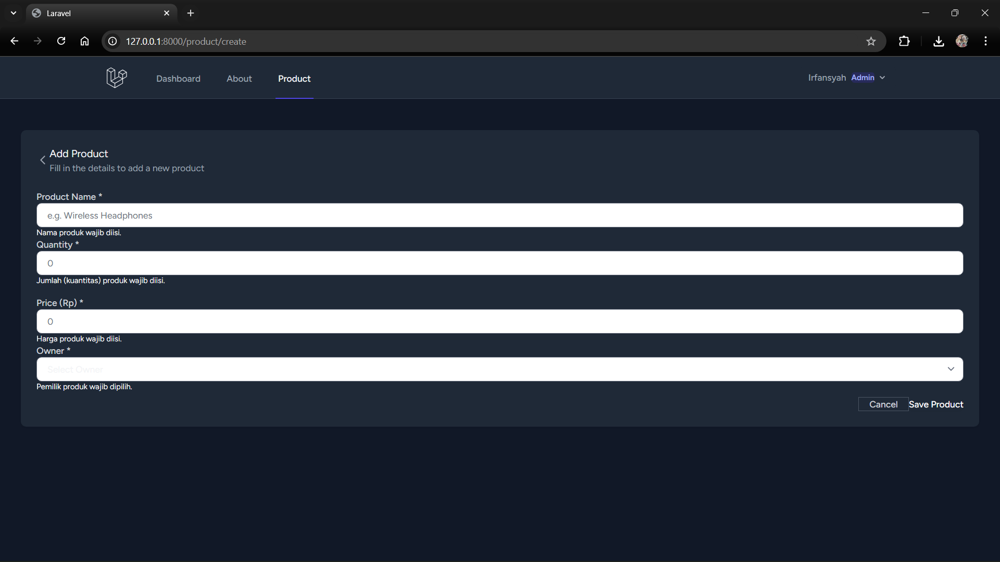
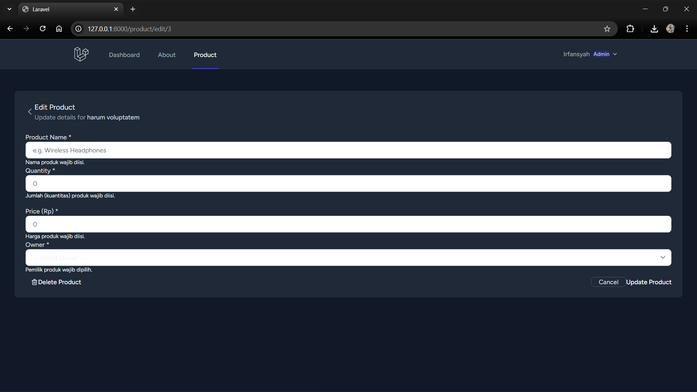

# Praktikum 6: Laravel Validation

## 1. UI if data not valid (Store/add product from request validation)

## 2. UI if data not valid (Update product from request validation)

### Available validation on the form:
- 'Nama produk wajib diisi.'
- 'Nama produk harus berupa teks.'
- 'Nama produk tidak boleh lebih dari 255 karakter.'
- 'Jumlah (kuantitas) produk wajib diisi.'
- 'Jumlah produk harus berupa angka bulat (tidak boleh desimal).'
- 'Jumlah produk tidak boleh bernilai negatif.'
- 'Harga produk wajib diisi.'
- 'Harga produk harus berupa angka yang valid.'
- 'Harga produk tidak boleh bernilai negatif.'
- 'Pemilik produk wajib dipilih.'
- 'Pemilik produk yang dipilih tidak valid.'